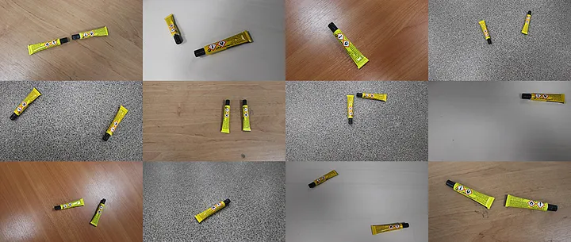
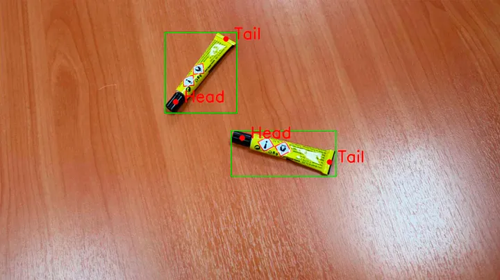

# Example Keypoiint Detector
Example of architecture modification of Mask-RCNN keypoint detector to create a multimodel keypoint detector




Download the [Dataset](https://drive.google.com/file/d/1VgY4IfjtgdI78s380UvtpdRWAwWOL3R9/view) and extract it to the root of the project. Then change the folder name to dataset. You would have the following structure:

```
dataset
├── test
│   ├── annotations
│   └── images
└── train
    ├── annotations
    └── images
```


## Resources
*   [Tutorial](https://medium.com/@alexppppp/how-to-train-a-custom-keypoint-detection-model-with-pytorch-d9af90e111da)
*   [Model](https://pytorch.org/vision/main/models/generated/torchvision.models.detection.keypointrcnn_resnet50_fpn.html)